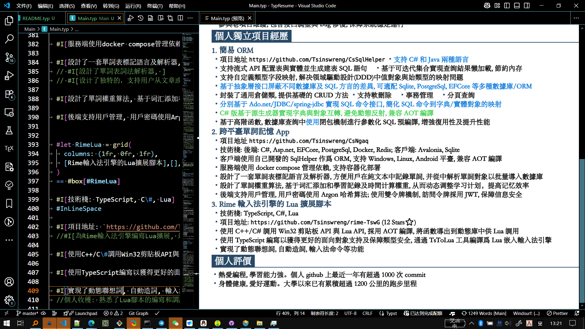
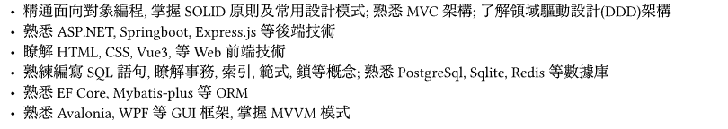

pandoc README-Simp.md -o README-Simp.docx
# Chinese Résumé in Typst \| 基于Typst语言的中文个人简历

Typst 是用于排版的 可编程 标记语言、拥有变量, 函数与包管理等
现代编程语言的特性、注重于科学写作。定位与 LaTeX 相似。支持编译为PDF。

此项目是本人的简历、使用Typst语言撰写。

# 预览图




此项目支持

-   多版本编译

-   真伪信息分离

# 为甚么使用Typst?

-   可编程。支持变量、函数、包管理等、更加灵活

-   源码为纯文本,
    便于版本控制、易于调整样式(Word直接显示排版效果、不方便视察与修改内部的样式逻辑)

-   格式与内容分离、便于制作模板

-   语法简洁、易于学习。不需要复杂功能时完全能当Markdown用

-   编译速度快、支持实时预览、实时预览时支持源码与效果页双向定位跳转

-   支持数学公式, 图片, 表格, 布局等

# 构建

我的typst版本: `typst 0.13.1 (8ace67d9)`

``` bash
cd Main
typst compile Main.typ
```

(源码中个人习惯皆用繁体中文。可结合Opencc命令行工具在构建时输出简体中文、此项目未提供。)

# 项目结构

``` bash
293.jpg # 头像
Cfg.typ # 编译配置
CfgCs.typ # C#版简历配置
CfgItems.typ # 配置项
CfgJava.typ # Java版简历配置
CfgMix.typ # 混合版简历配置
Code.typ # 样式代码
Info.typ # 个人信息
InfoFake.typ # 假信息
InfoKeys.typ # 个人信息字典键
InfoReal.typ # 真信息
Main.typ # 主文档
```

# 将此简历作为模板使用

直接按需改Main.typ等文件里的内容即可。最好有一定typst基础。

# 多版本编译

此简历项目支持以下功能:

-   针对不同岗位、编译不同版本(此简历中有 C#, Java, Mix三种版本)

-   一真一假两套个人信息独立存储
    无侵入主文档。真实信息用于现实中实际投递等、假信息用于在网络上展示等。

通过`Cfg.typ`文件来配置版本:

以下是`Cfg.typ`讲解:

``` typst
#import "CfgItems.typ":* // 引用可选的配置标志

#let IsShowAvatar = true // 是否显示头像
#let IsReal = true // 是否使用真实信息
#let Tendency = TendCSharp // 选择简历版本
#let Mode = ModeRelease // 发布模式。ModeDebug模式下会按不同颜色突显示不同版本简历的差异、ModeRelease模式则统一正文颜色。
```

正文中涉及条件编译之处 举例:

``` typst
#if Tendency == TendMix{
    MixSkill
}else if Tendency == TendCSharp{
    CSharpSkill
}else if Tendency == TendJava{
    JavaSkill
}else{
    [=== Mix]
    MixSkill
    [=== CSharp]
    CSharpSkill
    [=== Java]
    JavaSkill
}
```

# 关键效果解析

## 列表中多项合入一行

列举技能要点等场景时、首先会想到使用Typst内置的列表。如:

``` typst
#[
    - 精通面向对象编程, 掌握SOLID原则及常用设计模式; 熟悉MVC架构; 了解领域驱动设计(DDD)架构
    - 熟悉ASP.NET, Springboot, Express.js等后端技术
    - 了解HTML, CSS, Vue3, 等Web前端技术
    - 熟练编写SQL语句, 了解事务, 索引, 范式, 锁等概念; 熟悉PostgreSql, Sqlite, Redis等数据库
    - 熟悉EF Core, Mybatis-plus等ORM
    - 熟悉Avalonia, WPF等GUI框架, 掌握MVVM模式
]
```

效果: 

有的行
右侧空白较多。当**有压缩空间的需求**时、可以用以下办法来做一个假的
支持行内多项的列表:

``` typst
#[
    //列表项
    #let I(doc)={//•
        text()[・]+doc
    }

    //行内多个无序列表之间隔
    #let InLineSpace = h(0.8em)

    #set par(spacing: 0.5em) //段落间隔
    
    //换行后之缩进
    #set par(hanging-indent: 1em)

    #I[精通面向对象编程, 掌握SOLID原则及常用设计模式; 熟悉MVC架构; 了解领域驱动设计(DDD)架构]

    #I[熟悉ASP.NET, Springboot, Express.js等后端技术]
    #InLineSpace #I[了解HTML, CSS, Vue3, 等Web前端技术]

    #I[熟练编写SQL语句, 了解事务, 索引, 范式, 锁等概念; 熟悉PostgreSql, Sqlite, Redis等数据库]
    
    #I[熟悉EF Core, Mybatis-plus等ORM]
    #InLineSpace
    #I[熟悉Avalonia, WPF等GUI框架, 掌握MVVM模式]

]

```

效果: 

## 色底白字 带下分隔线的一级标题


文字外围的色块使用`rect`函数绘制。分隔线使用`box`函数、将高度设置为一像素。

使用`grid`布局将标题块与分隔线分别置于左右两侧。

``` typst
#[
    //主题色
    #let MainColor = red

    //一级标题函数
    #let H(doc)={
        //段距
        set par(spacing: 0em)
        
        //标题下方ʹ分隔线
        let Line = box(height: 1pt, width: 53em, fill: MainColor)

        //白字函数
        let White(doc)={
            set text(white)
            doc
        }

        //字ˇ绕ʹ白块。使用左右的grid布局
        let Box = grid(
            columns: (auto, 1fr)//左边设为auto让他占据尽量小的空间
            ,rect(fill: MainColor)[#White(doc)]//左边为标题块
            ,align(bottom)[#box(height: 1pt, width: 50.5em, fill: MainColor)] //右边为低部分隔线
        )

        //标题无文字时只显示分隔线
        if doc != [] {
            [= #Box]
        }else{
            Line
        }
    }

    #H[专业技能]
]
```

## 字体粗细问题

(参照了`"@preview/cuti:0.2.1"`包的实现)

Typst的加粗依赖字体族中提供的粗号字体。若使用的字体族中不包含粗号字体则需用文字描边(stroke)模拟实现

如

``` typst
#[
    #set text(font: "STSong")
    一二三四

    *一二三四*
]
```

效果为:  第二行字并没有加粗效果。

此时可为需加粗的文字设置stroke:

``` typst
#[
    #set text(font: "STSong")
    
    一二三四

    #text(stroke: 0.1em)[一二三四]
]
```

效果:


使用stroke设置基字体粗细时、
stroke默认下给文字添加的描边为黑色。当文字本身为其他颜色时、添加的黑色描边会影响效果。如

``` typst
#[
    #set text(stroke: 0.04em)

    黑色字

    #text(fill: red)[红色字]
]
```

 可见「红色字」被描上了黑边。

为解决此问题、可结合show规则、在传入的函数中通过`context`获取文字本身的颜色并设为描边颜色

``` typst
#[
    #let BaseStroke = 0.04em //基字体粗细
    #let FnBaseStroke(doc, ..params)={
        context{
            if(text.stroke == none){//只针对未设置过stroke的文字、降低优先级 防止覆盖
                set text(
                    stroke: BaseStroke+text.fill//加粗旹 把描边颜色设成和原色 一致
                )
                doc
            }else{
                doc
            }
        }
    }

    #show text: it=>FnBaseStroke(it) //不能用show: FnBaseStroke

    黑色字

    #text(fill: red)[红色字]

    
]
```

效果: 
