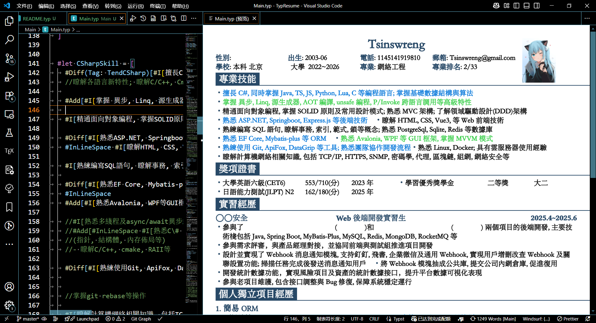
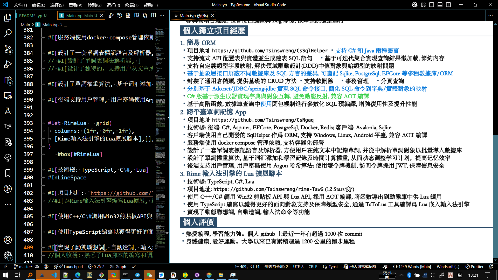

# Chinese Résumé in Typst \| 基于Typst語言的中文個人簡歷

Typst 用于排版的可編程標記語言、擁有變量,
函數與包管理等現代編程語言的特性、注重于科學寫作。定位與 LaTeX
相似。支持編譯爲PDF。

此項目是本人的簡歷、使用Typst語言撰寫。

支持

-   多版本編譯

-   真僞信息分離

# 構建

我的typst版本: `typst 0.13.1 (8ace67d9)`

``` bash
cd Main
typst compile Main.typ
```

(源碼中個人習慣皆用繁體中文。可結合Opencc命令行工具在構建時輸出簡體中文、此項目未提供。)

# 預覽圖





# 項目結構

``` bash
293.jpg # 頭像
Cfg.typ # 輸出配置
CfgCs.typ # C#版簡歷配置
CfgItems.typ # 配置項
CfgJava.typ # Java版簡歷配置
CfgMix.typ # 混合版簡歷配置
Code.typ # 樣式代碼
Info.typ # 個人信息
InfoFake.typ # 假信息
InfoKeys.typ # 個人信息字典鍵
InfoReal.typ # 真信息
Main.typ # 主文檔
```

# 將此簡歷作爲模板使用

直接按需改Main.typ等文件裏的內容即可。最好有一定typst基礎。

# 多版本編譯

此簡歷項目支持以下功能:

-   針對不同崗位、編譯不同版本(此簡歷中有 C#, Java, Mix三種版本)

-   一真一假兩套個人信息獨立存儲
    無侵入主文檔。真實信息用于現實中實際投遞等、假信息用于在網絡上展示等。

通過`Cfg.typ`文件來配置版本:

以下是`Cfg.typ`講解:

``` typst
#import "CfgItems.typ":* // 引用可選的配置標誌

#let IsShowAvatar = true // 是否顯示頭像
#let IsReal = true // 是否使用真實信息
#let Tendency = TendCSharp // 選擇簡歷版本
#let Mode = ModeRelease // 發佈模式。ModeDebug模式下會按不同顏色突顯示不同版本簡歷的差異、ModeRelease模式則統一正文顏色。
```

正文中涉及條件編譯之處 舉例:

``` typst
#if Tendency == TendMix{
    MixSkill
}else if Tendency == TendCSharp{
    CSharpSkill
}else if Tendency == TendJava{
    JavaSkill
}else{
    [=== Mix]
    MixSkill
    [=== CSharp]
    CSharpSkill
    [=== Java]
    JavaSkill
}
```
